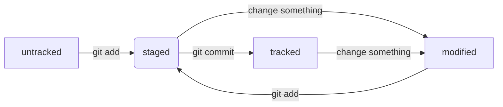

# Знания по Git

1 - не связываться с vs кодом

## Начало

1 - создаешь папку  
2 - выбираешь эту папку в гите: cd c:/----/papka  
3 - git init  
4 - делаешь с этой папкой что хочешь  
5 - заходишь в [github](github.com)  
6 - cоздаешь там репозиторий  
7 - в гите пишешь: git add --all  
8 - не забываешь проверять себя: git status  
9 - git commit -m "обязательно поясняешь за свои изменения"  
10 - git remote add origin ссылка на репозиторий в гитхабе  
11 - git branch -M main (называет основную ветку main)  
12 - git push -u origin main (пункты 10, 11 и -u надо писать только в первый раз)  
13 - кайфуешь
## Приколы
* хеш - приблуда которая кодирует твои данные. Причем если данные одинаковые, то хеш тоже будет одинаковым
* логи позволяют узнать всё о коммитах, рекомендуется дописывать --oneline
* 'HEAD' - тоже самое, что и хеш последнего коммита
* крч статусы там и прочая инфа

# Ветки в Git 
## Клонирование чужого репозитория  
git clone git@github.com:YandexPraktikum/first-project.git (от англ. clone, «клон», «копия») — склонируй репозиторий с URL first-project.git из аккаунта YandexPraktikum на мой локальный компьютер.

## Создание веток  
git branch feature/the-finest-branch (от англ. branch, «ветка») — создай ветку от текущей с названием feature/the-finest-branch;  
git checkout -b feature/the-finest-branch — создай ветку feature/the-finest-branch и сразу переключись на неё.

## Навигация по веткам  
git branch (от англ. branch, «ветка») — покажи, какие есть ветки в репозитории и в какой из них я нахожусь (текущая ветка будет отмечена символом *);  
git branch -a — покажи все известные ветки, как локальные (в локальном репозитории), так и удалённые (в origin, или на GitHub).  
git checkout feature/br — переключись на ветку feature/br.

## Сравнение веток  
git diff main HEAD (от англ. difference, «отличие», «разница») — покажи разницу между веткой main и указателем на HEAD;  
git diff HEAD~2 HEAD — покажи разницу между тем коммитом, который был два коммита назад, и текущим.

## Удаление веток  
git branch -d br-name — удали ветку br-name, но только если она является частью main;  
git branch -D br-name — удали ветку br-name, даже если она не объединена с main.

## Слияние веток  
git merge main (от англ. merge, «сливать», «поглощать») — объедини ветку main с текущей активной веткой. 

## Работа с удалённым репозиторием  
git push -u origin my-branch (от англ. push, «толкнуть», «протолкнуть») — отправь новую ветку my-branch в удалённый репозиторий и свяжи локальную ветку с удалённой, чтобы при дополнительных коммитах можно было писать просто git push без -u;  
git push my-branch — отправь дополнительные изменения в ветку my-branch, которая уже существует в удалённом репозитории;  
git pull (от англ. pull, «вытянуть») — подтяни изменения текущей ветки из удалённого репозитория.
