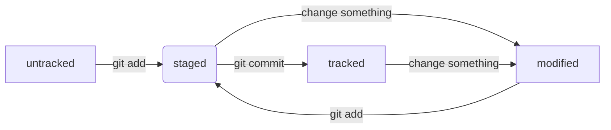

# Знания по Git

1 - не связываться с vs кодом

## Начало

1 - создаешь папку  
2 - выбираешь эту папку в гите: cd c:/----/papka  
3 - git init  
4 - делаешь с этой папкой что хочешь  
5 - заходишь в [github](github.com)  
6 - cоздаешь там репозиторий  
7 - в гите пишешь: git add --all  
8 - не забываешь проверять себя: git status  
9 - git commit -m "обязательно поясняешь за свои изменения"  
10 - git remote add origin ссылка на репозиторий в гитхабе  
11 - git branch -M main (хз что это, но пусть будет)  
12 - git push -u origin main (branch и -u надо писать только в первый раз)наверно  
13 - кайфуешь
## Приколы
* хеш - приблуда которая кодирует твои данные. Причем если данные одинаковые, то хеш тоже будет одинаковым
* логи позволяют узнать всё о коммитах, рекомендуется дописывать --oneline
* 'HEAD' - тоже самое, что и хеш последнего коммита
* крч статусы там и прочая инфа

